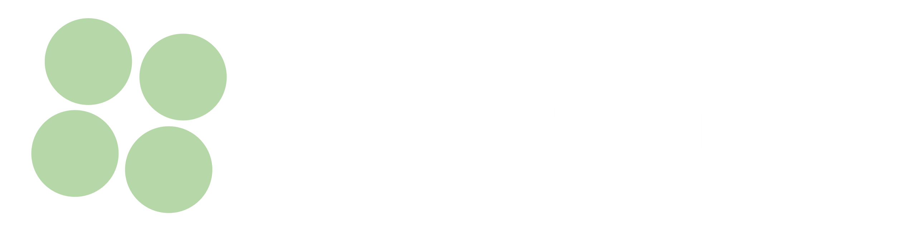

# アプリ名

# 概要
本アプリケーションは農業に特化したフリーマーケットコミュニケーションアプリである。

ユーザーは農作物の売買を行うことが出来る。

また、ユーザーの出品物や品質の信用を目的に、農業としての活動や取り組みなどをアピールとしてブログの投稿をすることが出来る。

# 本番環境
- アクセス方法
  - URL: http://35.74.82.120/
  - ID: admin
  - pass: 2222
- ログイン情報（テスト用）
  - 出品者・投稿者
    - Eメール：sell@sample.com
    - パスワード：1234567890asdfghjkl
  - 購入者
    - Eメール：buy@sample.com
    - パスワード：1234567890asdfghjkl
    - 購入時カード情報
      - 番号: 4242424242424242
      - 期限: 1月２５年
      - セキュリティーコード: 123

# 制作背景（意図）
近年、農業業界における年齢層の高齢化が著しく大きな社会問題となっている。

さらに、市場や飲食店に提供するための品質基準が非常に厳しく、食事をする分には全く問題が無いのにも関わらず、大量の農作物のロスが発生している農家が多いのが現状である。
これらの問題が原因で、若年層の農業業界への参入を困難にさせていると考えている。

従って、この問題を解決するために、若年層においても気軽に農作物を売買取引が出来るアプリケーションの開発を考えた。

農業への参入障壁を下げることで農作物のロス削減と高齢化の防止が期待できるだけでなく、若年層の増加で先端科学技術の導入が進みやすくなることが期待でき、農業業界の発展につながると考えている。

# DEMO
## トップページ
上のタブから出品商品の一覧ページと、投稿ブログ一覧ページを表示します

## マイページ表示
マイページを表示します。例としてユーザー名（ニックネーム名）のタブから遷移します

何も出品・投稿していないユーザーは下記のような表示になります

## 商品出品機能
みどりの市場トップページの右下『出品する』ボタンから出品ページへ遷移し、情報を記入して商品を出品します

## ブログ投稿機能
みどりのブログトップページの右下『投稿する』ボタンから投稿ページへ遷移し、情報を記入してブログを投稿します

## 商品購入機能
他のユーザーの出品商品を購入します。購入が完了すると在庫数が１つ減ります。

# 工夫したポイント
- フリーマーケットアプリにブログ投稿機能を実現したこと
  - 若年層の多くはSNSを利用しており、その感覚で本アプリが利用できるようにすることで利用者の増加を狙う
  - 本フリマアプリは飲食物を取り扱う。そのため、出品者の信用の確保と売買回転率の向上などのアピールが必要となる
- 農作物の産地や１商品あたりの容量がわかりやすくしたこと
- 商品の在庫数を反映したこと。さらに出品者は出品している商品を自由に在庫数の編集ができる設計になっていること
- なるべくシンプルなUIや機能の設計を心がけたこと
  - 多機能なアプリケーションの開発をすると便利であるが、同時に扱いにくさが発生する
  - シンプルな設計はユーザーの混乱を回避することができ、快適なアプリケーションの利用を実現する
- UIのオリジナリティーを持たせたこと
  - 『みどりの市場』のロゴは自分で作ったこと
  - 全ての色彩に日本の伝統色を採用していること
    - 苔色、弁柄色、浅葱色など

# 使用技術（開発環境）
## バックエンド
Ruby, Ruby on Rails
## フロントエンド
JavaScript, JQuery, Ajax
## データベース
MySQL, SeauelPro
## インフラ
## Webサーバー（本番環境）
nginx
## アプリケーションサーバー（本番環境）
unicorn
## ソース管理
GitHub, GitHubDesktop
## テスト
RSpec
## エディタ
VSCode

# 課題や今後実装したい機能
- ブログ・出品商品のコメント機能
- ブログ・出品商品の添付画像の複数化
- ブログ投稿日時の表示
- 計り売り機能の実装
  - 現在は在庫数で購入しているが、もう一つの購入機能として計り売りも実装したい
  - 本機能は N kg あたり X 円として出品ができ、好きなkg数で購入ができるようになる
- 複数個数の購入機能の実装
  - 現在は１注文当たり１個しか購入できないので、複数購入できるようにしたい
- 検索機能の実装
  - カテゴリー別表示、入力文字列の一致表示、ジャンル別表示を導入し、ブログ・商品を発見しやすくする
- 購入履歴の表示
  - マイページで購入履歴を閲覧できるようにする
  - 商品の削除に対応できるようにしなければならない（このままではDBから削除された商品を表示しようとするのでエラーが生じる）
- フォロー・いいね機能の実装
- パスワード変更機能
  - 現在のパスワードのバリデーションには on: :create をがかかっている（マイページのプロフィール編集ができるようにするため）
  - このままで本機能を実装しようとすると、バリデーションがかからないパスワードの変更を許可してしまうことが予想されるので対策が必要
- UIの充実化
  - より見やすいUIの設計を考える
    - スクロールバーやスライダーの導入
    - ブログ・商品の表示数に制限をかけ、読み込みボタンを実装
  - 可能な限りJavaScript・JQuery・CSSでUIの躍動感を与える

# DB設計

## users テーブル

| Column                | Type    | Options                    |
| --------------------- | ------- | -------------------------- |
| email                 | string  | null: false, unique: true  |
| encrypted_password    | string  | null: false                |
| nick_name             | string  | null: false, unique: true  |
| kanji_family_name     | string  | null: false                |
| kanji_given_name      | string  | null: false                |
| katakana_family_name  | string  | null: false                |
| katakana_given_name   | string  | null: false                |
| date_of_birth         | date    | null: false                |
| farmland_name         | string  |                            |
| farmland_region       | string  |                            |
| hectare               | float   |                            |
| exp_year              | integer |                            |
| crops                 | string  |                            |

### Association

- has_many :items
- has_many :contents
- has_many :orders

## items テーブル

| Column              | Type        | Options                        |
| ------------------- | ----------- | ------------------------------ |
| name                | string      | null: false                    |
| price               | integer     | null: false                    |
| description         | text        | null: false                    |
| category_id         | integer     | null: false                    |
| condition_id        | integer     | null: false                    |
| pesticides_id       | integer     | null: false                    |
| amount              | float       | null: false                    |
| stock               | integer     | null: false                    |
| shipping_charge_id  | integer     | null: false,                   |
| shipping_source_id  | integer     | null: false,                   |
| shipping_date_id    | integer     | null: false,                   |
| user                | references  | null: false, foreign_key: true |

### Association

- belongs_to :user
- has_one :order
- has_one_attached :image

## contents テーブル

| Column  | Type        | Options                        |
| ------- | ----------- | ------------------------------ |
| title   | string      | null: false                    |
| text    | text        | null: false                    |
| user    | references  | null: false, foreign_key: true |

### Association

- belongs_to :user
- has_one_attached :image

## orders テーブル

| Column     | Type       | Options                        |
| ---------- | ---------- | ------------------------------ |
| user       | references | null: false, foreign_key: true |
| item       | references | null: false, foreign_key: true |

### Association

- belongs_to :user
- belongs_to :item
- has_one :address

## addresses テーブル

| Column        | Type       | Options                        |
| ------------- | ---------- | ------------------------------ |
| zip_code      | string     | null: false                    |
| prefecture_id | integer    | null: false                    |
| city          | string     | null: false                    |
| address       | string     | null: false                    |
| building      | string     |                                |
| phone_number  | string     | null: false                    |
| order         | references | null: false, foreign_key: true |

### Association

- belongs_to :order
